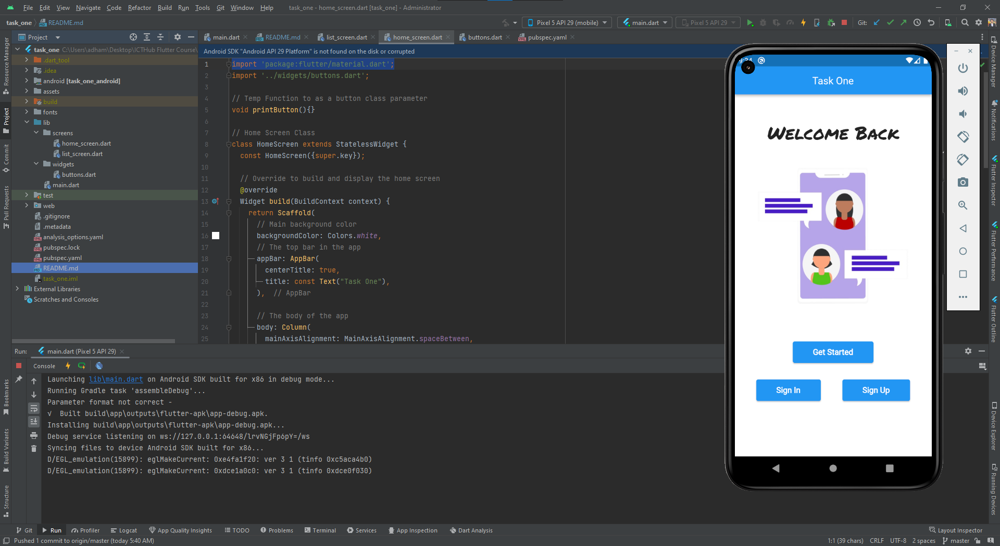
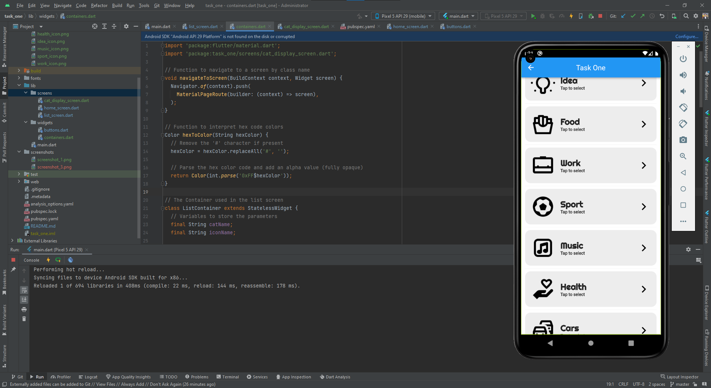
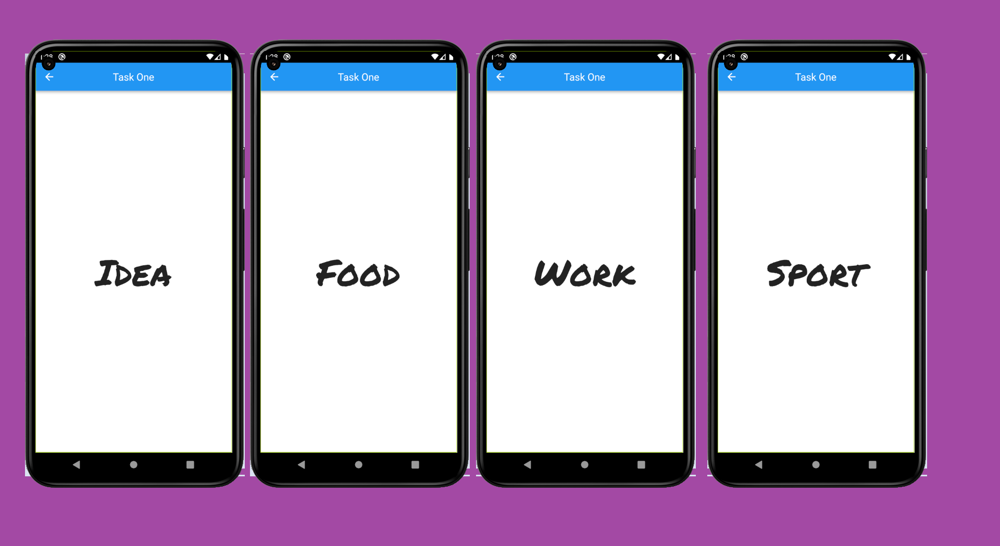
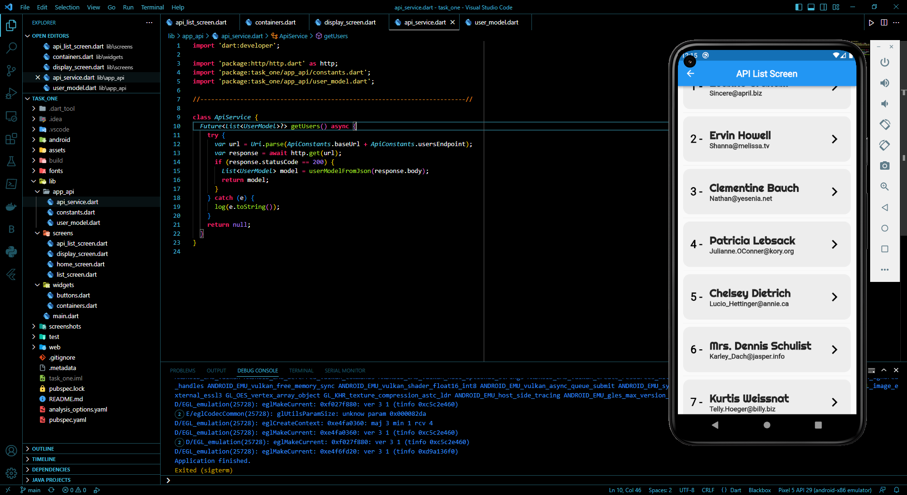

# ICTHUB Flutter Task One

A flutter project created as a task for the ICTHUB Flutter Course

## Task Details

### *[ Part one ]*

First part of the task was to create a landing page using widgets like text, buttons and adding an image. 

I created a home screen page in a seperate dart file that has a "Welcome Back" text with a custom font and an Image added from the local assets of the project, then I created a new dart file that has class for the home screen button.

I used widgets beside the basic ones such as:
- ElevatedButton
- Container
- Align

**Part one Screenshot**

---

### *[ Part Two ]*

Second part of the task to create a new screen with a list using ListView to choose a category and then get directed to a page that displays the name of that category

After creating the second screen I created a container in a class that can be replicated in the list screen to display the items, then each container is used as a link to a third screen that displays the name of the category that was clicked on

I found that I can do the whole app with stateless widgets but I created a second version of the third screen **(cat_display_screen.dart)** in both statless and stateful widgets and commented out one of them.

**Part two Screenshots**

---

### *[ Testing API With Flutter ]*

Using http dart library I added a list with 10 users that are not stored locally but fetched from a [JSON database](https://jsonplaceholder.typicode.com/users) when the users clicks on the API List screen.

Creating multiple dart files, one of them is to parse the data fetched and convert it to a list (file copied not written not written from scratch) and another file to do the request itself.

**API List Screenshot**

---

***Task Created by: Adham Elshabasy***
